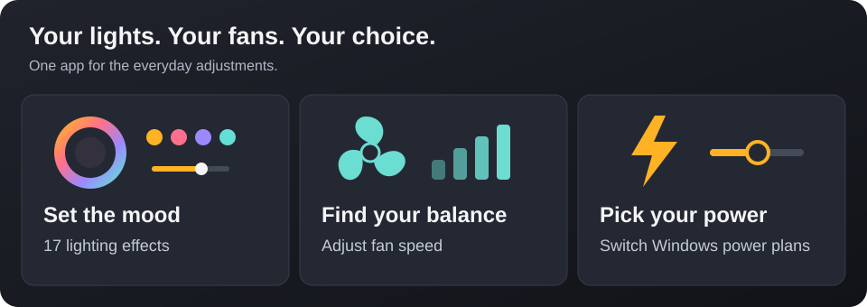

# OpenCrate

**Make your PC feel like yours.**

Control your PC's lights, fans and power settings in one free app.
An alternative to Armoury Crate for supported ASUS hardware.

Windows 10 / 11 · x64 · Free & open source

## Get started in 3 steps

1. **Download.** Open the [latest release](https://github.com/yibudak/opencrate/releases/latest). Under **Assets**, choose the file ending in **`windows-x64-setup.exe`**. The “Source code” files are for developers.
2. **Install.** Open the downloaded file and follow the setup instructions.
3. **Make it yours.** Open **OpenCrate** from the Start menu. In **Lighting**, pick an effect and click **Apply changes**.

The current installer is unsigned, so Windows may show an unknown-publisher warning.

## Will it work on my PC?

- **Windows:** Windows 10 (1809 or later) or Windows 11, on an x64 PC. ARM-based PCs are not supported.
- **Lights:** Only certain ASUS lighting controllers are supported. Not every ASUS PC or accessory will work. See [supported hardware](https://github.com/yibudak/opencrate/blob/main/rev/REFERENCE.md#hardware-support).
- **Fans:** Require a compatible ASUS fan service already installed and running. OpenCrate does not install it. **Keep your existing ASUS fan service if you want fan control.**

Armoury Crate itself is not required, but removing ASUS software may also remove the fan service.
Windows power controls work independently; available options depend on your PC.

## A few useful things

| You want to… | Here's how |
| --- | --- |
| Change the language | **Settings → Application language**. English, 简体中文 and Türkçe are included. |
| Start the app with your PC | Turn on **Launch with Windows** in Settings. |
| Keep it running in the background | Close the window. OpenCrate stays in the icon area next to the Windows clock. |
| Exit completely | Right-click the OpenCrate icon next to the clock → **Quit**. |

<!-- markdownlint-disable MD033 -->

<strong>Updating, uninstalling or wondering what happens when you quit?</strong>

- **Update:** Choose **Quit** from the OpenCrate icon menu, then run the new installer. Your preferences are kept.
- **Uninstall:** Quit first, then remove OpenCrate from Windows **Settings → Apps**. Saved preferences are kept.
- **When you quit:** Lighting switches to a built-in effect, temporary fan changes are restored where OpenCrate still controls them, and Windows power changes stay applied.

<!-- markdownlint-enable MD033 -->

## Need a hand?

[Report a problem or suggest a feature](https://github.com/yibudak/opencrate/issues/new/choose) · [Advanced guide](https://github.com/yibudak/opencrate/blob/main/rev/REFERENCE.md) · [Contribute](https://github.com/yibudak/opencrate/blob/main/CONTRIBUTING.md)

OpenCrate is an independent project, not affiliated with or endorsed by ASUS.
Released under the [MIT license](https://github.com/yibudak/opencrate/blob/main/LICENSE).
[Credits & acknowledgments](https://github.com/yibudak/opencrate/blob/main/rev/REFERENCE.md#credits).
